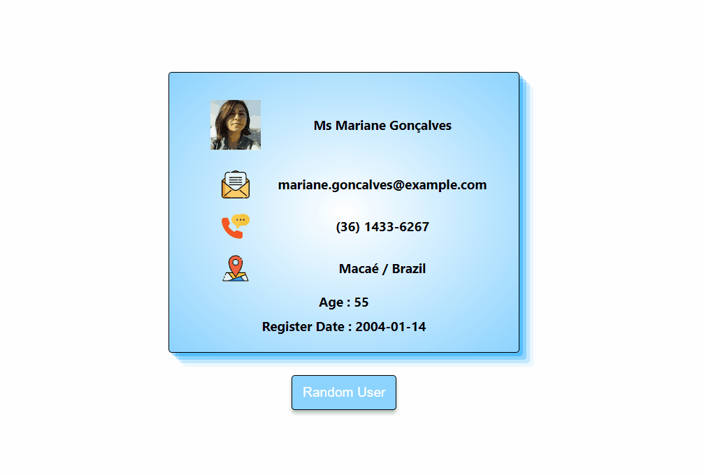

This is my Random User Application with React. 

For look [please click here](https://random-user-react-project.netlify.app/)

Project: Random User App 

Description
Project aims to create a Random User App.

Project Skeleton :

Random User App (folder)
|
|----readme.md         
SOLUTION
├── public
│     └── index.html
├── src
│    ├── assets
│    │       └── [images]
│    ├── App.js
│    ├── App.css
│    ├── index.js
│    └── index.css
├── package.json
└── yarn.lock

Objective
Build a Random User App using ReactJS.

At the end of the project, following topics are to be covered;
HTML
CSS
JS
ReactJS

At the end of the project, i will be able to;
Improve my coding skills within HTML & CSS & JS & ReactJS.

I use git commands (push, pull, commit, add etc.) and Github as Version Control System.

☺ Happy Coding ✍
